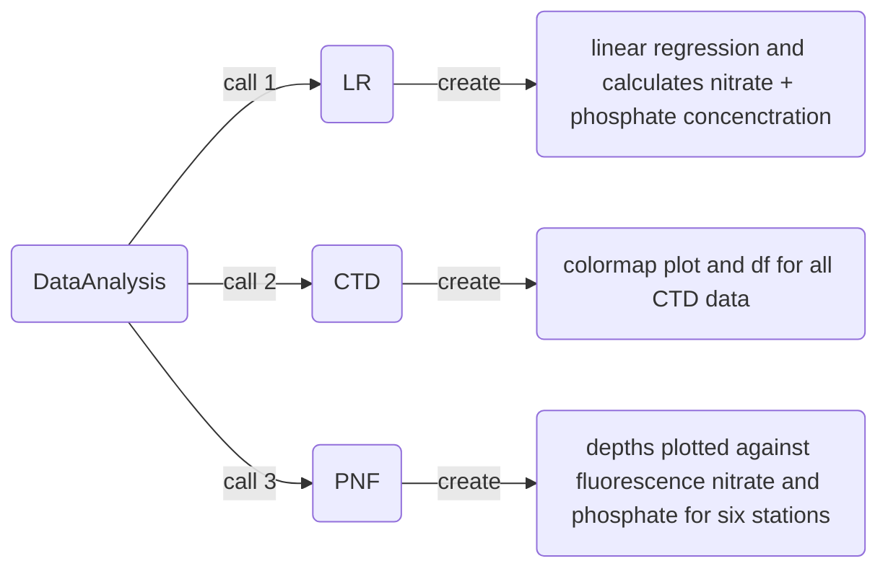

# About the Indiviual Report in MAR 440
This repository provide all used scripts for the data analysis in the master's course [MAR440](https://www.gu.se/en/study-gothenburg/marine-project-from-idea-to-action-mar440) for the Individual Report of the BOX Project. The report was written with Alma Holmsten (no Github Account available) at University Gothenborg. 

# About the BOX Project
Eutrophication is one of the main problems of the Baltic Sea. It is mainly caused by human pollution from industry and animal husbandry, which leads to the accumulation of nutrients in the sea. An increase in phosphate and nitrate repeatedly leads to the spread of cyanobacteria during the summer months, which have a negative impact on the Baltic Sea ecosystem.\supercite{munkes2021cyanobacteria} After one of the largest spreads of cyanobacteria in the Baltic Sea in 2005, many projects were launched to combat the problem of eutrophication.\supercite{conley2009tackling} One of the solutions was the Baltic Oxygenation (BOX), which was launched in 2010.\supercite{stigebrandt2015experiment} The idea was to pump oxygenated surface water into the deep sea. The project was carried out for 2 1/2 years in Byfjorden. As a result of the pumping, the water in Byfjorden was enriched with more oxygen and eutrophication decreased greatly, while the number of living organisms increased. Now, about 9 years after the project was completed as part of a group project in the MAR440 master's course, Byfjorden will be compared with the neighboring Havstenfjorden in terms of oxygen levels, nitrate and phosphate concentrations, and living conditions. Comparing the two fjords, which are separated by a 13 m sill, will allow us to compare the change in the artificially oxygenated Byfjorden with the pristine Havenstenfjorden. (Extract from individual report indtroduction)

# Use of Python scripts
# Requirements
Create two folders named **Data** and **Images** inside the folder where the python scripts are.
The folder **Data** should have the **CTD-Data** inside. In the Images folder the figures will be save.
On Unix like operating systems just type the following command in your terminal inside the python script folder.
```
$ mkdir Data && mkdir Images
```

## Modules
Required installations of Python libraries:
```
$ pip install pandas
$ pip install matplotlib
$ pip install numpy
$ pip install scipy
```
The installations are also possible with conda.

## Program structure

## Scripts
There are three scripts uploaded which tackle different tasks but rely on the output of each other. The scripts are specificly build for the data sended from the supervisor, why I will not explain the exact structur of the needed files. The scripts should be easily adjusted for different approaches or slightly differences in the sended files. The following part will shortly summarize function of the different scripts.

### DataAnalysis.py
DataAnalysis is the main script from where you can start all other scripts and the help function for each program, to see the data requirements.

### LR.py
This script reads a excel document in, where the linear regression is calculated based on measured standars. Afterwards the sample concentration from the collected samples were calculated based on the linear regression.
Two plots show the linear regression for nitrogen and phosphate will two additional plot show to sample locations inside the linear regression. Furthermore two data files called data0.tsv (for nitrate) and data1.tsv (for phosphate) will be created.

### CTD.py
The goal of this script is to create a dataframe for the CTD-Data of all stations and create out of this dataframe colormap plots.

### PNF.py
Creates figures for six stations, depth is plotted against fluorescence as well as nitrate and phosphate concentration.
